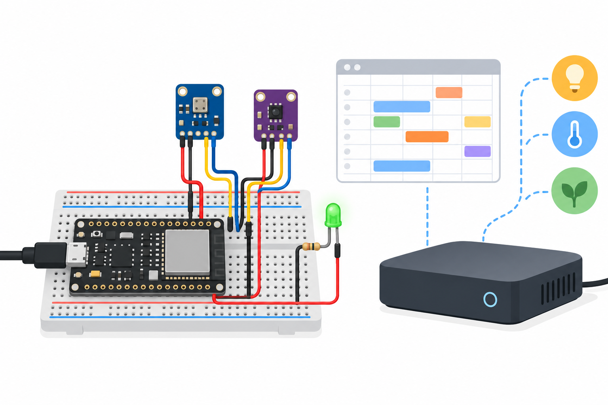

# Room Climate Hub Adaptive Scheduling
A Home Assistant + ESPHome prototype that learns a per-hour occupancy pattern and recommends a low voltage LED schedule. BH1750 light level and BME280 climate measurements gate the recommendation. Occupancy comes from an explicit Home Assistant helper; these environmental sensors do not measure people.



## Objectives and features
Learn persistent hourly occupancy scores, environmental gates, clock validation, native HA integration and optional Matter export. On each valid minute, score[hour] += (occupied-score[hour])/60. Sixty occupied samples raise an initially zero score to about0.635. Unoccupied samples decay it. It is a simple heuristic, not a predictive model.

## Architecture and platform
ESP32 DevKit ESPHome2026.9.1 ESP-IDF; HA supplies time/occupancy and receives sensor/light entities. Matter connectivity uses the separately installed [Matterbridge-hass](https://github.com/Luligu/matterbridge-hass) plugin exporting HA entities. ESPHome itself does not speak Matter. [Architecture](docs/architecture.md). Clock, API and fresh sensor data are required; LED off on invalid data at the next60s interval.

## BOM quantities
| Quantity | Item |
|---|---|
| 1 | ESP32 DevKit esp32dev |
| 1 | BME280 3.3V I2C breakout |
| 1 | BH1750 3.3V I2C breakout |
| 1 each | LED,330Ω resistor,breadboard,USB5V supply |
| 10 | Jumper wires |
| 1 | Home Assistant host; Matterbridge service on same LAN |
| 1 optional | Matter controller for export verification |

## Prerequisites
Python3.12, ESPHome2026.9.1, USB serial access, 2.4GHzWi-Fi, working Home Assistant, Node.js version supported by current Matterbridge and IPv6/mDNS LAN for Matter pairing. Store all Wi-Fi/API/HA tokens only in local runtime configuration. No credentials belong in this repository.

## Exact pin map and circuit/wiring
| ESP32 pin | Net |
|---|---|
| GPIO21 | BME280 SDA + BH1750 SDA |
| GPIO22 | BME280 SCL + BH1750 SCL |
| 3V3 | Both VCC; BME CSB |
| GND | Both GND; BME SDO; BH ADDR; LED cathode |
| GPIO25 | 330Ω →LED anode |
| USB | Regulated5V input |
BME address0x76, BH0x23. [Precise editable SVG](docs/circuit-diagram.svg), [wiring](docs/wiring.md). Pull-ups must be3.3V. Illustration is not a wiring netlist.

## Assembly
Disconnect power. Join grounds and3.3V sensor rails, wire I2C, set address straps, add resistor/LED. Inspect polarity, then USB power. I2C log must find0x23/0x76. Do not use a BMP280 expecting humidity.

## Setup and flashing
```sh
python -m pip install esphome==2026.9.1
cp firmware/secrets.example.yaml firmware/secrets.yaml
# Edit ignored secrets.yaml with lab Wi-Fi values.
esphome config firmware/device.yaml
esphome compile firmware/device.yaml
esphome run firmware/device.yaml
```
First flash via USB. Add discovered device in HA ESPHome integration. Include [HA package](home-assistant/package.yaml) through your configured HA packages directory and restart/reload appropriate configuration. This creates input_boolean.room_climate_occupied. Toggle manually for demonstrations; optionally feed it from an existing tested presence sensor. Ensure HA grants device access to HA states and time.

## Configuration and usage
24 hourly scores restore from flash; writes batch hourly to reduce wear, so a power loss can lose recent learning. Home Assistant's local clock hour selects the bin; timezone/DST changes alter interpretation. Initial scores zero. Set thresholds in shared [schedule policy](firmware/schedule.h). LED on requires lux<100, occupied or score≥0.35, temperature<30C, humidity<80%. Sensor updates30s; ages≤120s are accepted. Recommendation recalculates each60s. Light can be manually controlled from HA/Matter until the next policy interval; use only the LED demonstration.

## Matter configuration
Install current Matterbridge and matterbridge-hass following its linked upstream README. Configure HA host and token privately in the Matterbridge runtime UI. Use a dedicated allowlist label and add only this device's Temperature, Humidity, Illuminance and Schedule Permission entities. Restart plugin, verify exposed types, then pair the Matterbridge QR code to your controller. Never commit HA token, pairing data or fabric keys. Pressure support varies by controller. HA/Matter fabric end-to-end tests have not been performed here; optional bridging is an integration path, not a claim of a tested radio.

## Telemetry/data formats and expected output
HA native API exports measured temperature°C, humidity%, pressurehPa, lux, Hourly Occupancy Score and Schedule Permission light state. ESPHome serial logs provide I2C and entity updates. [Policy JSON example](sample-data/schedule.json) is illustrative, not recorded hardware data. Dark occupied room yields LED on under climate bounds; bright room or unavailable data yields off. Hourly score grows while helper on and decays while off.

## Actual run test results
[Validation results](docs/validation-results.md) records cloud observations. Hardware, HA and Matter tests not performed.
```sh
g++ -std=c++17 tests/schedule_test.cpp -o /tmp/schedule
/tmp/schedule
python -m unittest discover -s tests
python tools/validate.py
python tools/validate_completion.py
esphome config firmware/device.yaml
esphome compile firmware/device.yaml
```
CI supplies fake example secrets only for compilation.

## Troubleshooting
No sensors: check3.3V pull-ups, address straps and sharedGND. Unknown occupancy: helper ID/native API permission. No score: invalidHAclock/API, sensorNaN or freshness. Matter missing: plugin label filters, controller support, IPv6/mDNS, runtime host/token. Bright-light gate intentionally suppresses output.

## Limitations and domain safety
Hourly exponential averages do not separate weekdays, infer presence or optimize energy. No autonomous clock, certified safety, secure-by-default lab API or remote availability guarantee. Configure native API encryption in private deployment before leaving isolated lab. No HVAC/mains actuator; do not use LED recommendations for safety, comfort-critical equipment or access control. Sensor calibration and physical timing remain unmeasured.

## Future work
Add tested presence input, weekdays, drift/calibration, secure runtime provisioning and complete HA/Matter hardware integration tests.

## Contributing and license
Keep shared policy tests, firmware pin map and docs consistent. See [test plan](docs/test-plan.md). Contributions and full [LICENSE](LICENSE) use MIT.
